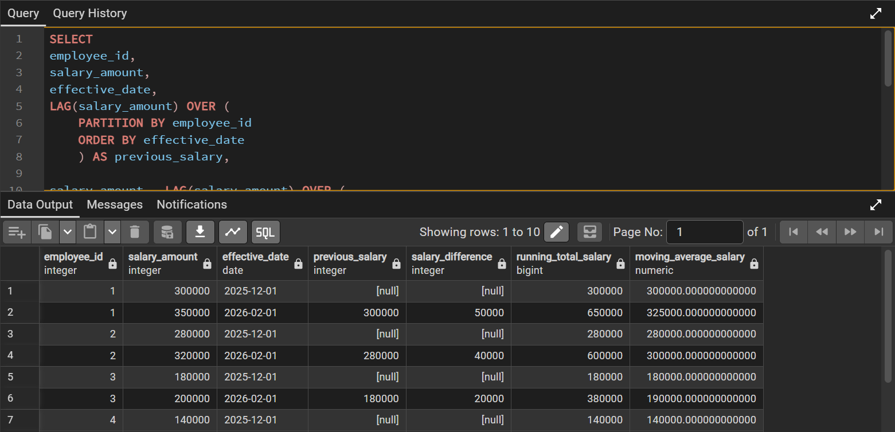

🏢 Project Title

Employee Salary Growth & Payroll Efficiency Analysis System

🎯 Business Problem

Organizations often struggle to track how employee salaries evolve over time, making it difficult to:

identify unfair or inconsistent salary increases
monitor payroll growth trends
detect compensation anomalies
understand long-term employee cost impact

This project solves that problem using SQL-based time-series analysis.

🗄️ Dataset Overview

The system uses a salary history table containing:

employee_id
salary_amount
effective_date

This represents a historical record of employee compensation changes over time.

🧠 Tools & Techniques
SQL Window Functions
LAG()
SUM() OVER
AVG() OVER
Partitioning by employee
Time-series analysis

📊 Key Analysis Performed
1. Salary Progression Tracking

Identifies how employee salaries change over time.

2. Salary Difference Analysis

Measures increase or decrease between salary updates.

3. Running Total Salary

Tracks cumulative salary cost per employee.

4. Moving Average Salary

Smooths salary fluctuations to reveal trends.

💡 Business Insights
Employees show varying salary growth patterns
Some employees experience large salary jumps, requiring review
Running totals help estimate long-term payroll exposure
Moving averages reveal compensation stability across time

📈 Business Impact

This analysis helps HR and management to:

improve salary fairness and consistency
monitor payroll cost growth
detect irregular compensation patterns
support data-driven salary decisions
📸 Output Evidence

(screenshot of SQL query results here)
## 📊 Salary Analytics Output (Full Window Functions Report)

This output shows employee salary progression over time, including:

- Previous salary comparison (LAG)
- Salary difference tracking
- Running total salary accumulation
- Moving average salary trend

This helps HR understand compensation growth patterns and payroll pressure over time.

🚀 Conclusion

This project demonstrates how SQL window functions can be used to transform raw salary data into meaningful business intelligence for HR decision-making.
